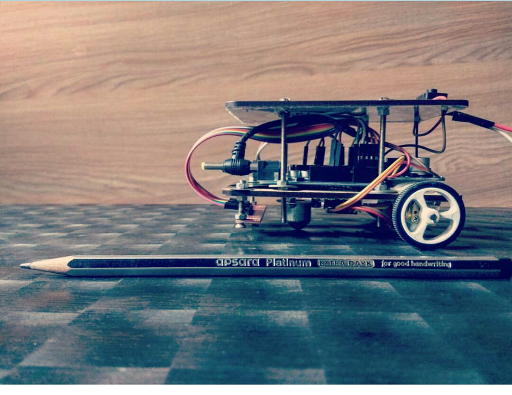

# lets_follow

Linefollower is an automatic and self contained robot that solves mazes in order to reach a final goal position.

## Competitions participated :
-	Techfest 2017, IIT Bombay ( **6th** position)
-	Kshitij 2018, IIT Kharagpur ( **2nd** position)
-	Technex 2018, IIT(BHU), Varanasi ( **2nd** position)

## Our Bot
Bot specification :

- Sensors : Pololu QTR-RC, generic IR sensors
- Motors : Pololu 1:75  400 rpm high torque
- Battery : Li-ion 9v input
- Voltage regulator : Buck Boost 9v to 7v
- Motor driver : Pololu DRV
- Microcontroller : Arduino Mega ADK.
- Size : 10cmx6cmx6cm

Our robot is a completely self made double decker model. The body is of a two wheel - castor wheel type with its base made of Hardwood material. We followed a modular approach for both hardware and software for ease of debugging and quick replacement of parts. 

The sensory system has a total of 8 IR sensors :

1.  6 (expandable to 8) dedicated PID sensors in QTR-RC array used only for detection of line so that it can function easily on any width of line.

2. Two separate independent Simple IR sensors for reserved for finding turns in the arena.

With two discrete systems for line following and turn detection so that it is very unlikely that our bot will get lost in the unhappy event of a bad turn and consequent misalignment.

Currently our motors are high torque but low rpm as we conservatively chose a lower speed for better PID control. However now that we are confident enough in our design that we might in the future have 1000 rpm motors.

Moreover, to remove the dependency on time based delays , we added rotary encoder for accurate distance measurement.

As for our power management system we have a long lasting three hours battery pack and a spare as well. For protection of circuits we used a generic Buck-Boost converter for stepping down the direct voltage.

In the past we have used Arduino UNO as the brain of our robot, however, due to lack of pins we replaced it with an Arduino MegaADK. 

Lastly for testing our algorithms, we made a graphical python application. To use it we compile the non Arduino-specific parts of our program to an executable on our computer. Then using remote function calling over interprocess pipe, we can simulate the robot's movements over a variety of maps before our hardware is even ready. 

We use a dfs - dijkstra approach to our algorithm so that it remains generic and isn't tied to any specific problem statement. So, we only needed to change our program based upon problem statement of the competition.

